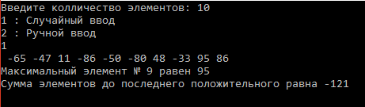

# Работа с одномерным массивом
Простая программа по работе с одномерным массивом. Поиск максимального элемента в массиве и нахождение суммы элементов до последнего положительного.
<h2>Результат работы программы</h2>

